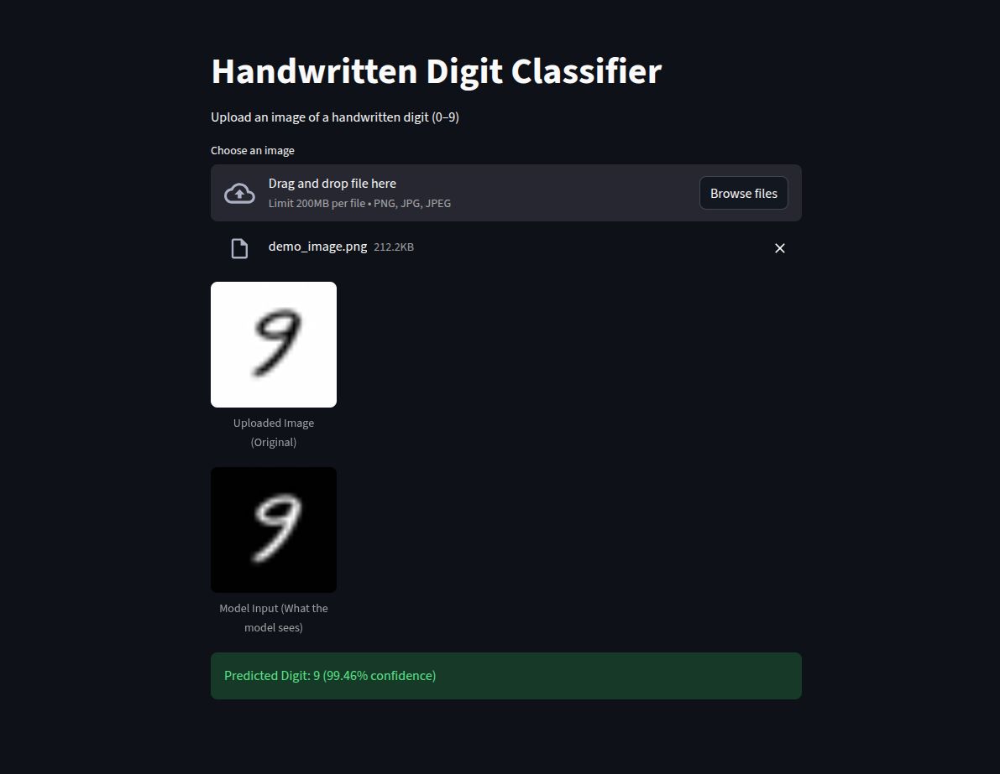

# MNIST-DIGIT-CLASSIFIER
# 🧠 Handwritten Digit Classifier (MNIST)

A deep learning project that classifies handwritten digits (0–9) using a Convolutional Neural Network (CNN) trained on the MNIST dataset, with a Streamlit web interface for real-time predictions.

---

## 🚀 Demo
Upload an image of a handwritten digit and the model predicts the digit along with confidence.



---

## 🛠️ Tech Stack
- Python 3
- TensorFlow / Keras
- NumPy
- Pandas
- Streamlit
- Pillow (PIL)

---

## 📂 Project Structure
mnist-handwritten-digit-classifier/
│── app.py # Streamlit app
│── mnist_cnn_model.keras # Trained CNN model
│── requirements.txt # Dependencies
│── README.md
│── notebooks/
│ └── mnist_training.ipynb
│── screenshots/
│ └── app_demo.png


---

## 📊 Model Overview
- Input: 28×28 grayscale images
- Architecture:
  - Convolutional layers
  - MaxPooling
  - Fully connected Dense layers
- Output: 10-class softmax (digits 0–9)
- Loss: Categorical Crossentropy
- Optimizer: Adam

---

## 🔍 Key Preprocessing Steps
- Grayscale conversion
- Image resizing to 28×28
- Color inversion (MNIST format)
- Normalization (0–1)
- Reshaping for CNN input

---

## 🖥️ How to Run the Project
streamlit run app.py

### 1️⃣ Clone the repository
```bash
git clone https://github.com/YOUR_USERNAME/mnist-handwritten-digit-classifier.git
cd mnist-handwritten-digit-classifier

